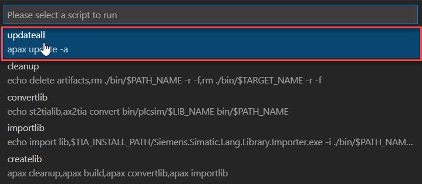
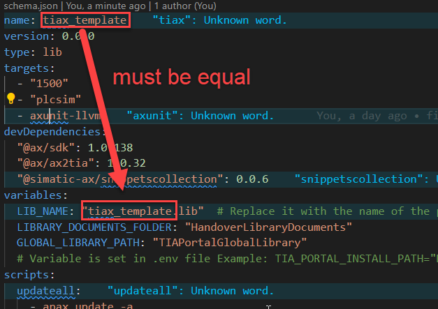

# Template for AX and TIA Portal workflow
## Setup template

1. If not done, login to the AX registry

1. If not done, login to the GitHub registry
   
    More information you'll find [here](https://github.com/simatic-ax/.github/blob/main/doc/personalaccesstoken.md)

1. create a new library project from template 
      ```cli
      apax create @simatic-ax/tiax --registry https://npm.pkg.github.com
      ```
1. Install the dependencies

   ```cli
   apax install -L 
   ```

   or with update of all packages implicitly 

   ```cli
   apax update -a
   ```
   
   or run script `updateall`

      1. Select `Run Script`
   
            

      2. Select `updateall`
      
            

1. Open the `apax.yml` and modify the variable vor `LIB_NAME` (line 13). The value of the parameter must be equal to the name of the project.

      

1. Open the .env File and adapt your installation path of the file `Siemens.Simatic.Lang.Library.Importer.exe`

      Default Path: `D:\TIA\DS\1406_18.00.00.00_15.01.0001\Step7Professional\bin`
      
1. Optionally adapt the snippets to your namespace

      Adapt the snippet `./snippets/usingNamespace.json`

      ```json
      {
         "USINGAxUnit": {
         "scope": "javascript,typescript,st",
         "prefix": ["USING DemoLibrary"],  // adapt prefix
         "body": [
            "USING Simatic.Ax.DemoLibrary;", // adapt your namespace
            "$0"
         ],
         "description": "Create USING for your library;"
         }    
      }
      ```

      and adapt the snippet `./snippets/namespacesupport.json`

      ```json 
            "NamespaceSupport": {
            "scope": "javascript,typescript,st",
            "prefix": ["CreateNamespace for DemoLibrary"], //adapt prefix
            "body": [
                  "NAMESPACE Simatic.Ax.DemoLibrary", //adapt your namespace
                  "\t$0",
                  "END_NAMESPACE"
            ],
            "description": "Creates an namespace template"
            }    
      ```

## Create the library

Execute the command:

```
apax createlib
```
 